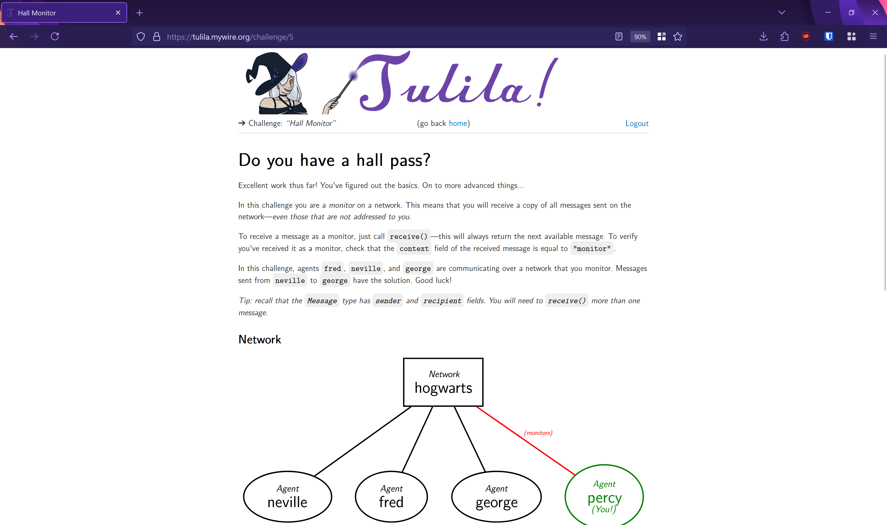

# Tulila

#### An agent- and message-based simulation framework for computer security challenges

_My honours project, completed in Winter 2025._

Modern computer security is more than just algorithms—every day, terabytes of communications are secured with protocols such as TLS and SSH. Flaws in these protocols can and do compromise security goals even without flaws in the underlying algorithms. Existing teaching and auto-grading tools are not suited to simulate protocols: they lack the vocabulary to express key concepts like agents and messages. This project introduces Tulila, a simulation framework and auto-grading tool where agents, networks, and messages are first-class concepts. Tulila is purpose-built to be the perfect tool for learners to explore protocol flaws hands-on and for teachers to teach and evaluate knowledge of protocol vulnerabilities. Agent behavior is defined using Python, and attack primitives such as active and passive interception are built-in, making Tulila flexible enough to simulate any protocol vulnerability or vulnerability class.

I've very happy with this project. I think it's some of the best code I've ever written and I think what it does is very cool. Thank you for checking it out!

## The Report

The best introduction to this is in the very well-organized 36 page report [here](https://github.com/startrekdude/tulila/blob/master/report/report.pdf). This report contains a detailed description of what Tulila is, why it's cool, how to install and use it, and how it's implemented. Credit for third-party content is also in this report (special shoutout to my partner, who drew the banner image!).

The link to the live instance of Tulila is dead, as I only had enough Digital Ocean credits to run it for a few months. You are more than welcome to set it up yourself and play with it, though!

## License

Non-commercial, non-institutional use is permitted.

My project supervisor, without whom this would not have been possible, may use this for any purpose.

For any other use, contact me and we'll work something out.

## Directory Structure

- `bin/`: entry points to an installed copy of Tulila.
- `challenges/`: some challenges shipped with Tulila. This includes 7 tutorial challenges and 3 cryptography challenges.
- `dev-scripts/`: scripts used in the development of Tulila.
- `modules/`: the source code of Tulila. The report has a section breaking this down further.
- `report/`: the project report.
- `scripts/`: scripts shipped with (but not installed with) Tulila. This contains the logic for installing it, which is not used after it is installed.